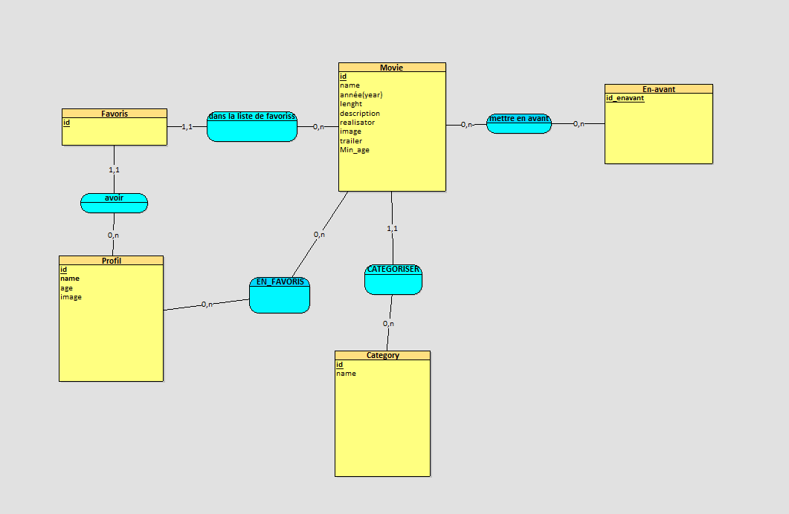

REICH MALO

## EVOLUTION DE LA BDD AU COUR DE LA SAE 203

Itération 1:
sql:
getAllFilm($Age)
$sql = "SELECT \* FROM Movie
on séléctionne tout les films
vue:

Itération 2:

sql:
addFilm($Titre, $Réalisateur, $Année, $Durée, $Description, $categorie,
$file, $URL, $Restrictions)

SELECT id FROM Category WHERE name = :name

ce premier select sert à insérer la catégorie sous son id à partir de son nom
c’est utilisé aprés pour l’insert
INSERT INTO Movie (name, director, year, length, description,
id_category, image, trailer, min_age)
VALUES (:name, :director, :year, :length, :description, :id_category, :image, :trailer, :min_age)

Itération 3:
sql:
getFilm($id)
on séléctionne un film avec son id
SELECT \*FROM Movie JOIN Category ON Movie.id_category = Category.id
WHERE Movie.id = :id";
vue: pas de changement

Itération 4:
getFilmCategorie($name_category, $age)
SELECT id FROM Category WHERE name = :name
ce premier select sert à insérer la catégorie sous son id à partir de son nom
c’est utilisé aprés pour l’insert
"SELECT FROM Movie WHERE id_category = :id_category AND min_age <= :age"
vue: pas de changement

Itération 5:
sql:
addProfil($Nom, $Age, $file)
INSERT INTO Profil (name, age, image) VALUES (:name, :age, :image) ON
DUPLICATE KEY
UPDATE age = VALUES(age),
image = VALUES(image);

vue:

Itération 6:
sql:
getAllProfil()
SELECT _ FROM Profil
getunProfil($id)
SELECT _ FROM Profil WHERE id = :id
vue: pas de changement

Itération 7:
getAllFilm($Age)
SELECT \* FROM Movie WHERE min_age <= :age
vue: pas de changement

Itération 8:
sql: pas de changement l’itération 5 permet la modification si le nom est le
même
vue: pas de changement

Itération 9:
sql: addFavoris($id_film, $id_profil)
INSERT INTO Favoris (id_film, id_profil)
VALUES (:id_film, :id_profil)
vue:

Itération 10:
delFavoris($id_film, $id_profil)
DELETE FROM Favoris WHERE id_film = :id_film AND id_profil
= :id_profil
vue: pas de changement

Itération 11:
sql:
getAllFilmEnAvant($age)
SELECT Movie \*
FROM En_avant
JOIN Movie ON En_avant.id_film = Movie.id
WHERE Movie.min_age <= :age"

vue:

Itération 12:
sql:getAllFilm_char($age, $char)
$char = strtolower($char);
$sql = "SELECT \* FROM Movie WHERE min_age <= :age AND LOWER(name) LIKE :char";

n’est pas sensible à la casse, les majuscules sont convertit en majuscule

Itération 13:
sql:
add_Avant($id_film_add_avant)
INSERT INTO En_avant (id_film) VALUES (:id_film)

del_Avant($id_film_del_avant)
DELETE FROM En_avant WHERE id_film = :id_film
